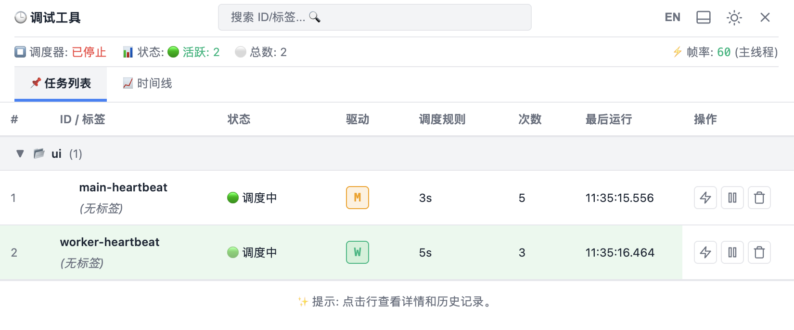

<p align="center">
  
</p>

<h1 align="center">Hyper Scheduler</h1>

<p align="center">
  
  
</p>

A lightweight, dependency-free (core) JavaScript task scheduler supporting Cron expressions and Web Workers.

## Features
- 🚀 **Cross-platform**: Works in Node.js and Browser.
- ⏰ **Precise Timing**: Uses Web Workers in browser to avoid background throttling.
- 🏷️ **Namespaces**: Isolate tasks into logical groups for batch control.
- ⚡ **Immediate Trigger**: Option to execute tasks immediately upon start.
- 🛠 **Debuggable**: Built-in debug panel and CLI output.
- 📦 **Tiny**: < 20KB gzipped.

## DevTools



## Quick Start

```bash
npm install hyper-scheduler
```

```javascript
import { Scheduler } from 'hyper-scheduler';

const scheduler = new Scheduler({ debug: true });

// Standard task
scheduler.createTask({
  id: 'hello',
  schedule: '*/5 * * * * *',
  handler: () => console.log('Hello World')
});

// Task in a namespace with immediate execution
scheduler.createTask({
  id: 'system-check',
  schedule: '1h',
  handler: () => console.log('System Check'),
  options: {
    namespace: 'system',
    runImmediately: true
  }
});

scheduler.start();
// Or start only 'system' namespace: scheduler.start('system');
```

See [Documentation](https://crazymryan.github.io/hyper-scheduler) for more details.
