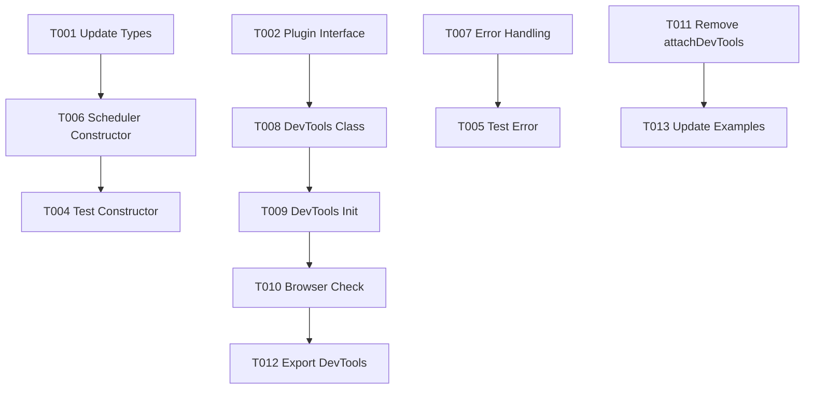

# 任务列表: 通过构造函数集成 DevTools

**功能分支**: `001-integrate-devtools-constructor`
**状态**: 待开始

## 阶段 1: 设置与基础设施

此阶段侧重于定义插件系统接口和类型定义，为后续实现打下基础。

- [x] T001 更新 `SchedulerConfig` 接口以支持 `plugins` 字段，文件路径: `src/types.ts`
- [x] T002 定义 `HyperSchedulerPlugin` 接口，文件路径: `src/types.ts`
- [x] T003 创建插件系统的单元测试骨架，验证接口定义的正确性，文件路径: `tests/unit/Plugin.test.ts`

## 阶段 2: 核心功能 (用户故事 1)

此阶段实现核心调度器的插件加载逻辑和 DevTools 插件的适配，同时移除旧的 `attachDevTools` 方法。

**目标**: 用户可以通过 `new Scheduler({ plugins: [...] })` 注入 DevTools。
**独立测试**: 单元测试验证 `init` 调用，集成测试验证 UI 挂载。

### 测试任务
- [x] T004 [US1] 编写 `Scheduler` 构造函数加载插件的单元测试，验证 `init` 方法被调用，文件路径: `tests/unit/Scheduler.test.ts`
- [x] T005 [US1] 编写插件初始化失败的测试用例，验证警告日志且不阻塞，文件路径: `tests/unit/Scheduler.test.ts`

### 核心实现
- [x] T006 [US1] 修改 `Scheduler` 类构造函数，实现插件数组的遍历和初始化逻辑，文件路径: `src/core/Scheduler.ts`
- [x] T007 [US1] 在 `Scheduler` 类中实现错误捕获机制，确保插件错误仅记录警告，文件路径: `src/core/Scheduler.ts`

### DevTools 适配
- [x] T008 [US1] 创建实现了 `HyperSchedulerPlugin` 接口的 `DevTools` 类，封装原有的挂载逻辑，文件路径: `src/ui/components/DevTools.ts`
- [x] T009 [US1] 实现 `DevTools` 类的 `init` 方法，支持接收 `theme` 等配置选项，文件路径: `src/ui/components/DevTools.ts`
- [x] T010 [US1] 确保 `DevTools` 插件仅在浏览器环境中执行挂载逻辑，文件路径: `src/ui/components/DevTools.ts`

### 清理与迁移
- [x] T011 [US1] 从 `Scheduler` 类中彻底移除 `attachDevTools` 方法，文件路径: `src/index.ts` (或 `src/core/Scheduler.ts` 视具体实现位置而定)
- [x] T012 [US1] 导出新的 `DevTools` 类供用户导入，文件路径: `src/index.ts`

## 阶段 3: 完善与清理

此阶段确例文档更新和示例代码的同步。

- [x] T013 更新 `examples/browser/index.html` 以使用新的插件构造函数方式初始化 DevTools
- [x] T014 更新 `examples/react-demo/src/App.jsx` 以使用新的插件构造函数方式
- [x] T015 更新 `examples/vue-demo/src/App.vue` 以使用新的插件构造函数方式
- [x] T017 更新 `docs/api/scheduler.md`，移除 `attachDevTools` 方法并新增插件相关说明。
- [x] T018 更新 `docs/guide/getting-started.md`，以新的插件方式展示 DevTools 的使用。
- [ ] T016 运行所有测试 (单元 + 集成) 确保无回归，文件路径: `package.json` (npm test)

## 依赖关系图

## 并行执行机会

- **核心与 UI 分离**: T006 (Scheduler 逻辑) 和 T008 (DevTools 类定义) 可以并行开发，只要 T001/T002 接口定义完成。
- **测试与实现**: T004/T005 (测试编写) 可以与 T006/T007 (功能实现) 并行进行 (TDD 模式)。
- **示例更新**: T013/T014/T015 可以由不同人员并行更新，一旦 API 变更完成。

## 实施策略

1.  **接口优先**: 首先定义 TypeScript 接口，确保契约明确。
2.  **核心支持**: 修改 `Scheduler` 支持插件加载，这是基础。
3.  **插件封装**: 将现有的 DevTools 逻辑迁移到新的插件类中。
4.  **破坏性移除**: 最后移除旧 API，并修复由此导致的构建错误（通过更新示例）。
5.  **验证**: 运行测试和示例，验证 Tree-shaking 效果 (虽然构建工具自动处理，但可通过检查 bundle 大小确认)。
