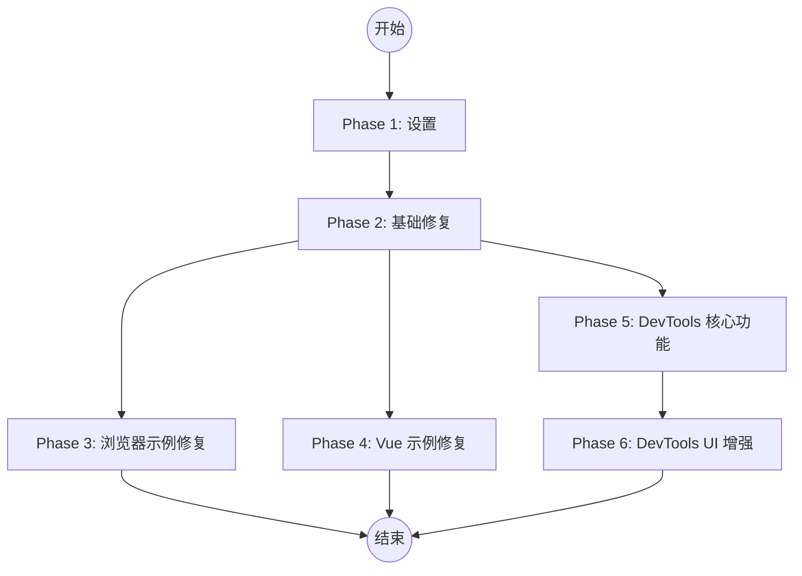

# 任务清单: 修复示例与 UI 对齐

**功能分支**: `004-fix-examples-ui-alignment`
**状态**: 待定

## 依赖图

## 实施策略

- **MVP 范围**: Phase 1, 2, 3。首先确保浏览器示例能跑通，解决 API 错误。
- **增量交付**: 
  1. 先修 API 调用错误 (Browser)。
  2. 再修构建错误 (Vue)。
  3. 最后重构 DevTools UI。

## Phase 1: 设置 (Setup)

此阶段确保环境准备就绪，进行必要的类型定义更新。

**目标**: 更新类型定义以支持新功能 (Tags)，并验证环境。

- [x] T001 更新 TaskDefinition 接口以包含 tags 字段 src/types.ts
- [x] T002 更新 Task 接口以包含 tags 字段 src/types.ts
- [x] T003 更新 Scheduler.createTask 方法以处理 tags src/core/Scheduler.ts

## Phase 2: 基础修复 (Foundational)

此阶段解决阻碍运行的核心问题：API 命名不一致和依赖导入问题。

**目标**: 修复 `cron-parser` 导入和 API 调用。

- [x] T004 修复 src/utils/schedule.ts 中的 cron-parser 导入方式以支持 ESM src/utils/schedule.ts
- [x] T005 验证 Node 环境下 schedule 工具是否正常工作 (运行测试) tests/unit/schedule.test.ts

## Phase 3: 浏览器示例修复 (User Story 1)

**目标**: 确保 `examples/browser` 无报错运行。

**独立测试标准**: 打开 `examples/browser/index.html`，控制台无 Error，任务正常打印日志。

- [x] T006 [US1] 将 examples/browser/index.html 中的 addTask 替换为 createTask examples/browser/index.html
- [x] T007 [US1] 移除 examples/browser/index.html 中对 require 的调用，改用全局变量或 ESM examples/browser/index.html
- [x] T008 [US1] 在浏览器示例中添加带有 tags 的任务演示 examples/browser/index.html

## Phase 4: Vue 示例修复 (User Story 2)

**目标**: 确保 `examples/vue-demo` 无构建错误。

**独立测试标准**: `npm run dev` 在 `examples/vue-demo` 下成功启动，页面无 SyntaxError。

- [x] T009 [US2] 检查并更新 examples/vue-demo/src/main.ts 中的 Scheduler 调用 examples/vue-demo/src/main.ts
- [ ] T010 [US2] 验证 Vue 示例中 cron-parser 是否正常加载 (依赖 T004) examples/vue-demo/src/App.vue

## Phase 5: DevTools 核心功能 (User Story 3)

**目标**: 重构 `DebugPanel` 以支持 Shadow DOM 和核心数据展示。

**独立测试标准**: 调用 `new Scheduler({debug: true})` 后，页面出现悬浮球或面板，且不影响宿主样式。

- [ ] T011 [US3] 重构 DebugPanel 使用 Shadow DOM 初始化容器 src/ui/DebugPanel.ts
- [ ] T012 [US3] 实现 Dashboard 视图 HTML 结构 (Header, Status, FPS) src/ui/DebugPanel.ts
- [ ] T013 [US3] 实现 Task List 表格视图 HTML 结构 src/ui/DebugPanel.ts
- [ ] T014 [US3] 实现 update 方法以渲染任务列表数据 (ID, Status, NextRun) src/ui/DebugPanel.ts
- [ ] T015 [US3] 添加 CSS 样式到 Shadow DOM 中 src/ui/styles.ts

## Phase 6: DevTools UI 增强与交互 (User Story 3 & 4)

**目标**: 实现 `ui-design.md` 中的交互功能 (Trigger, Tags, Actions)。

**独立测试标准**: 点击 Trigger 按钮任务立即执行；Tags 正确显示。

- [ ] T016 [US3] 在 Task List 中添加 Tags 列展示 src/ui/DebugPanel.ts
- [ ] T017 [US3] 实现 Actions 列 (Trigger, Pause/Resume 按钮) src/ui/DebugPanel.ts
- [ ] T018 [US3] 绑定 Trigger 按钮事件调用 scheduler.startTask (需确认是否需要新的 triggerTask API) src/ui/DebugPanel.ts
- [ ] T019 [US3] 绑定 Pause/Resume 按钮事件 src/ui/DebugPanel.ts
- [ ] T020 [US4] 优化 DevTools 样式以匹配设计稿 (深色模式/紧凑布局) src/ui/styles.ts

## Phase 7: 收尾与润色 (Polish)

**目标**: 清理代码，确保所有示例一致性。

- [ ] T021 检查所有示例 (含 Node/React) 是否使用了 createTask API examples/node/simple.js
- [ ] T022 运行所有测试确保无回归 tests/unit/Scheduler.test.ts
